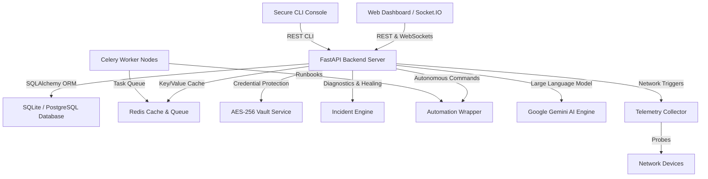

# Architecture Overview

This document outlines the software architecture of the Zero-Trust AI NOC Copilot system.

## System Components

### 1. Web Dashboard & CLI Simulator
- **Web UI**: Static HTML/JS client communicating via REST APIs and real-time Socket.IO events.
- **CLI console (`cli_harness.py`)**: Zero-Trust secure terminal client supporting username/password and TOTP authentication.

### 2. FastAPI Backend Application (`api/app.py`)
- Modular routes for auth, telemetry, incidents, configuration validation, zero-trust controls, and audits.
- Centralized lifespan hooks, slowapi-based rate limiting, and zero-trust security headers.

### 3. Incident Engine & Auto-Remediation (`incident_engine/engine.py`)
- Analyzes alerts, correlates events, and queries Gemini for root-cause analysis (RCA).
- Generates 13-point diagnostic plans and triggers self-healing config deployment if confidence meets the autonomous threshold.

### 4. Automation Wrapper & Playbook Runner (`automation_wrapper.py`)
- Executes automated commands across network devices via NAPALM and Netmiko.
- Defaults to a high-fidelity simulation fallback sandbox mode if live credentials are not present or `FORCE_SIMULATION=True`.

### 5. Telemetry Monitor (`telemetry/collector.py`)
- Asynchronous loop collecting packet metrics, RTT latency, memory partitions, and CPU usage.
- Evaluates system thresholds to emit alerts and trigger incident pipelines.

### 6. AES-256 Cryptographic Vault (`services/vault.py`)
- Encrypts device configurations and credentials at rest using AES-256 (Fernet) keys.
- Integrates with security logs to audit all decryption, addition, and key rotation actions.
