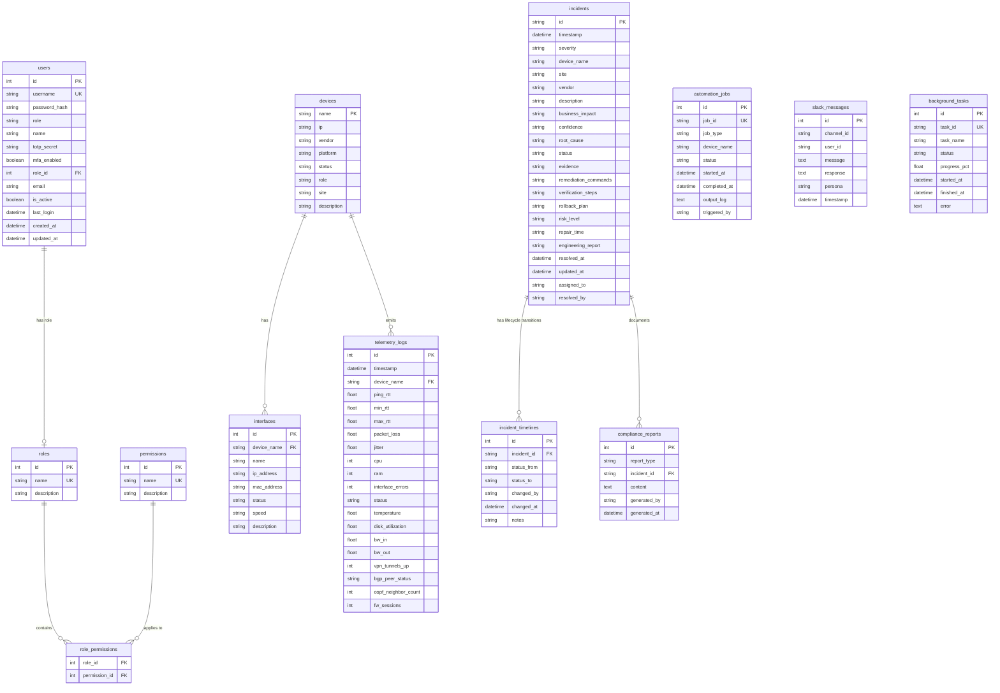

# Database Schema

This document details the relational database schema of the NOC Copilot system.

## Description of New Tables

### 1. `incident_timelines`
Tracks transitions between active/assigned/resolved states for auditing resolution metrics and incident SLA parameters.

### 2. `automation_jobs`
Logs automation runs initiated via Ansible, Netmiko, or NAPALM playbooks with output streams and execution duration logs.

### 3. `slack_messages`
Persists dialog details for the Slack Bot interactions for compliance reporting and training corpus extraction.

### 4. `compliance_reports`
Stores standard operational procedure drafts (SOPs), runbooks (MOPs), and root-cause reports (RCAs) generated by the AI engine.

### 5. `background_tasks`
Monitors system scans and long-running sub-tasks triggered dynamically by developers or NOC engineers.
